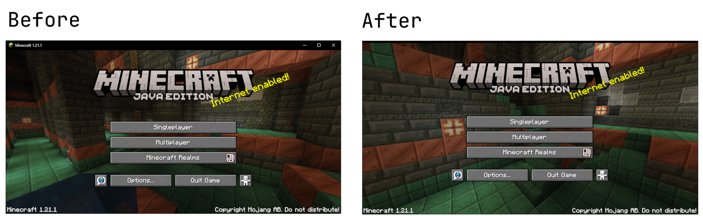

# Simple Borderless Window

Simple tool which removes the majority of a border, but still keeping the resizing functionality.



**This tool has only been tested on windows 11, so no guarantees it will work on other versions.**

Also, I have personally used this for a few months now, and have not had any issues with it. However, I cannot guarantee that it will work for you, or that it will not cause any issues. **Use at your own risk.**

## Usage

- Open the BorderRemover.exe file.
- Select whichever window you want to remove the border from.
- Click on the "Remove Border" button.
- Click on the "Restore Border" button to restore the border. 
  - Note: The border information is stored in-memory, meaning if you open and close BorderRemover, the border is unable to be restored without restart.
- Right click to exclude specific windows from your view.


### Possible upcoming features
- Favorite list
- Being able to remove an application from the excluded list

### Tips
- Border color can be specifically changed in Windows settings. I personally have a fully black border, as the white one is quite visible.

## Development
Python version: 3.11

Install the required packages using the following command (in root folder):
```powershell
pip install -r requirements.txt
```
### Building
To build the executable, you can use the following command:
```powershell
pyinstaller --onefile --noconsole --add-data 'icon.ico;.' main.py -n BorderRemover --icon=icon.ico

```

## Known Issues

- Applications with custom borders (non-default windows borders) cannot be changed
- When an application is excluded, you have to manually remove it from the excluded list in the settings file. (found `C:\Users\[USERNAME]]\AppData\Local\SimpleBorderlessWindow\IGNORED_WINDOWS.txt`)